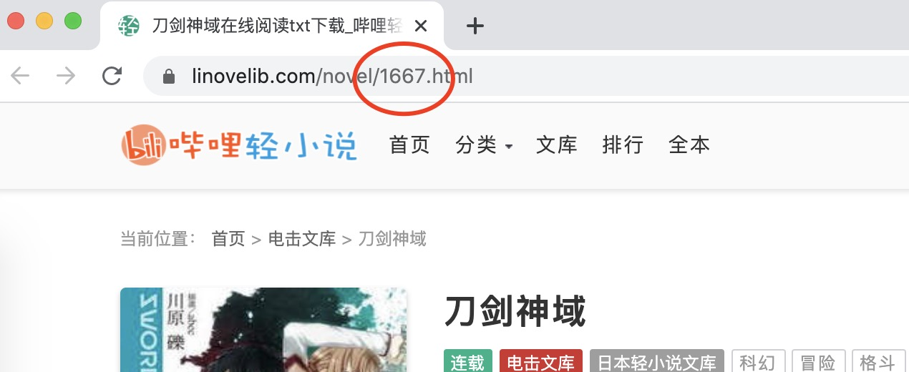

# 哔哩轻小说 RSS 生成器


通过小说 ID 抓取小说内容，生成 RSS 订阅内容，方便在订阅客户端阅读。

使用 Deno 开发，针对阿里云函数计算 custom runtime 优化，可直接部署到阿里云。

如果需要裸部署更改监听端口，可修改环境变量`FC_SERVER_PORT`。

## 使用方法

访问`https://www.linovelib.com/`获取要阅读的小说ID：



如图所示，小说ID是一个数字，然后我们根据这个拼接链接。

这里使用示例链接：`http://ln.rss.u1qo.com/`

直接将小说ID拼接到链接后面，如：`http://ln.rss.u1qo.com/2777`

打开你喜欢的 RSS 订阅 App ， 订阅上面的链接。

Enjoy

## 部署

*示例地址不一定长期提供服务*

此项目可自行部署使用，这里介绍两种部署方式。

### 裸部署

直接部署到普通服务器或 VPS ，根据需要修改环境变量`FC_SERVER_PORT`来改变监听的端口。

安装 Deno：

```shell
curl -fsSL https://x.deno.js.cn/install.sh | sh
```

然后执行以下命令：

```shell
deno run --allow-net --allow-env http://deno.u1qo.com/linovelib.ts
```

或者将本项目 Clone 下来执行：

```shell
deno run --allow-net --allow-env /path/to/linovelib.ts
```

### 阿里云函数计算

使用阿里云函数计算提供的 Custom Runtime 可以很方便部署本项目。

上面的示例地址就是使用这种方法部署。

准备：

- 安装`Funcraft`
- **Linux**版的`Deno`
- 安装适合本地环境的`Deno`，注意，除了`Linux`系统，其他都需要两个可执行文件，一个用于本地开发，一个用于部署到服务器

创建一个文件夹，然后初始化：

```shell
mkdir xxx && cd xxx
fun init
```

选择http函数，如`http-trigger-nodejs12`，这样就会创建一个默认的模版。

删除没必要的文件，然后将`Linux版的Deno`复制到这个文件夹。

修改`template.yml`：

```yaml
# 注意，这个是示例文件，大多数都可以保持不变
ROSTemplateFormatVersion: '2015-09-01'
Transform: 'Aliyun::Serverless-2018-04-03'
Resources:
  # 服务名，可根据需要修改
  linovelib:
    Type: 'Aliyun::Serverless::Service'
    Properties:
      Description: 'helloworld'
    # 函数名，可根据需要修改
    linovelib:
      Type: 'Aliyun::Serverless::Function'
      Properties:
        Handler: index.handler
        # 运行时修改成custom
        Runtime: custom
        CodeUri: './'
        # 内存限制，可选修改
        MemorySize: 128
        # 超时，建议设置一个较大值，这里设成10秒
        Timeout: 10
      Events:
        httpTrigger:
          Type: HTTP
          Properties:
            AuthType: ANONYMOUS
            # 允许的请求方法，可选
            Methods: ['GET']
```

执行以下命令：

```shell
deno bundle http://deno.u1qo.com/linovelib.ts bundle.js
```

将会生成一个`bundle.js`文件，这个是打包好依赖的最终文件。

然后创建一个`bootstrap`文件：

```shell
#!/bin/bash
./deno run --allow-net --allow-env bundle.js
```

添加执行：

```shell
chmod +x bootstrap
```

此时该文件夹大概有以下几个文件

```shell
bootstrap      # 入口文件
bundle.js      # 打包好的脚本
deno           # Linux版的deno
template.yml   # 配置模版
.funignore     # 忽略配置文件
```

部署（记得先登录）：

```shell
fun deploy -y
```

**部署后需要绑定一个自定义域名，因为阿里云路由没有清除前缀，所以需要绑定一个自定义域名，并且访问到第一层**

*绑定自定义域名需要备案，如果域名没有备案，可部署到香港或者海外的服务器再绑定域名*

如：`http://example.com/1234`

然后就可以使用了。

## 开源协议

MIT